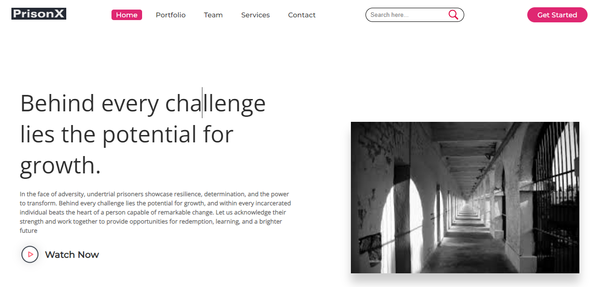

## PrisonX (E- Portal for UnderTrial Prisoners)

Try this out::  
https://github.com/lkhandelwal559

# E-Portal for Under Trial Prisoners

## Project Overview

Welcome to the E-Portal for Under Trial Prisoners, a comprehensive online platform designed to empower individuals in the legal system by providing valuable resources, education, and support. This project aims to address the diverse needs of undertrial prisoners, covering legal assistance, rehabilitation, and personal development.

## Features

1. Learning System:
   - Access online courses covering legal rights, vocational skills, and personal development.
   - Track your progress and earn certifications upon completion.

2. Pro Bono Lawyers Information:
   - Find pro bono lawyers willing to provide legal assistance.
   - View lawyer profiles, expertise, and contact information.

3. Case-Related Issues:
   - Stay updated on your case with access to documents and legal resources.
   - Participate in Q&A forums for case-related discussions.

4. Rehabilitation Activities:
   - Engage in skill development and  training programs.
   - Access counseling and mental health support services.

5. Studies and Preaching Platform:
   - Explore educational content on various subjects.
   - Access spiritual and motivational resources.
   - Share your stories and insights on the platform.

6. Rights and Benefits Information:
   - Learn about your legal rights and entitlements.
   - Stay informed about changes in laws affecting undertrial prisoners.

## Site Map

1. Home:
   - Overview of the portal's services and mission.
   - Latest news and updates.

2. Learning Center:
   - Courses and educational materials.
   - Progress tracking and certification.

3. Lawyers Directory:
   - Database of pro bono lawyers.
   - Lawyer profiles and contact information.

4. Case Hub:
   - Access to case-related documents.
   - Legal resources and terminology guide.
   - Q&A forum for case discussions.

5. Rehabilitation Corner:
   - Skill development and job training programs.
   - Mental health support services.
   - Community engagement initiatives.

6. Studies and Preaching:
   - Educational content and materials.
   - Spiritual and motivational resources.
   - User-generated content platform.

7. Rights and Benefits:
   - Information on legal rights and entitlements.
   - Updates on relevant legal changes.
   - Discussion forums for advocacy.

8. Profile:
   - User account management.
   - Notifications and communication settings.

9. FAQs and Help Center:
   - Frequently asked questions.
   - Support and assistance resources.

10. Contact Us:
    - Contact information and support channels.

## Getting Started

To explore our E-Portal for Under Trial Prisoners, simply visit our website []

## Support

If you have any questions or need assistance, contact our support team at support@undertrialportal.com.

Thank you for being a part of this initiative to empower undertrial prisoners!

Contact information and support channels
It is completely responsive website, to provide smooth experience...😎  

If you like my project, give it a star  😁😁😁
